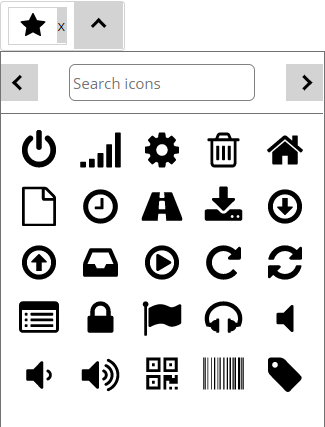
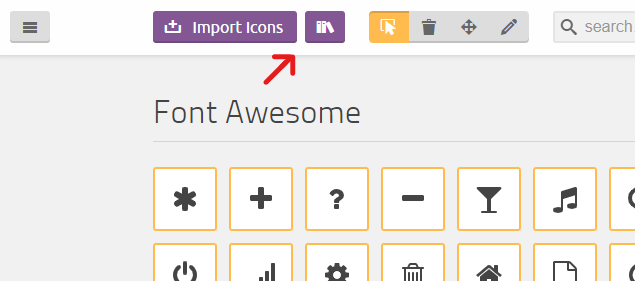

# sevengroupfrance/sulu-icon-picker-bundle

Inspired by [this pull request](https://github.com/sulu/sulu-demo/pull/66).

## What is this bundle's goal?
Importing a custom fonctionality into [sulu](https://github.com/sulu/sulu), in this example, a custom content type.\
This bundle will use an icon library from [IcoMoon](https://icomoon.io/).



## Installation
1. Download the [package](https://packagist.org/packages/sevengroupfrance/sulu-icon-picker-bundle) in your project with the following command line:\
`composer require sevengroupfrance/sulu-icon-picker-bundle`.
2. In `config/bundles.php` add the following code:\
`SevenGroupFrance\SuluIconPickerBundle\FontIconPickerBundle::class => ['all' => true]`.
3. In `assets/admin/package.json`, add the following line in the "dependencies" object:\
`"sulu-icon-picker-bundle": "file:node_modules/@sulu/vendor/sevengroupfrance/sulu-icon-picker-bundle/src/Resources/js"`.
4. In `assets/admin`, `npm install` to initialize the bundle's symlink directory.
5. In `assets/admin/index.js`, add this line:\
`import 'sulu-icon-picker-bundle'`.
6. In `assets/admin`, `npm run watch` or `npm run build`

## Create your own icon list with IcoMoon
From [this page](https://icomoon.io/app/#/select), we can choose whatever icons we want to use. If you want to import a library, click here:\


From here, you can choose whatever library you want by clicking on the `+  Add` button.\


Then, choose the icons you want to use in your project by clicking on them or select all in the menu on the top right side of your selection.
In the bottom menu, click on the `Generate SVG & More` button.\
From here, you may want to name your icons accordingly as there is a search functionality to this icon picker. Once done, click on the "download" button.

In the file you just downloaded, you'll need two files: `selection.json` and `symbol-defs`.
Replace the bundle's `selection.json` file content with your own, and replace the bundle's `Iconlist.js` file's `<defs>` tags content with your own.
If you want to put the entire SVG in `Iconlist.js`'s return function, please be careful to convert inline style with react style (from string to object).

## Load your SVG in your application's front
In your project's `templates` directory, create a new twig template.
In this template, paste the `symbol-defs` file content. Once done, import your twig template in your base twig template right after the `<body>` tag:\
``

## Use in your template files
Once installed, to use this new content type, you'll have to create a new property with the type `font_icon_picker`.
```
<property name="icon" type="font_icon_picker">
  <meta>
    <title lang="en">Section's Icon</title>
  </meta>
</property>
```
Also, to load the SVG on your back application, you'll have to create a new property with the type `icon_list` at the very top of your properties list.
```
<property name="your_icon_list" type="icon_list">
  <meta>
    <title lang="en"></title>
  </meta>
</property>
```
## Known issues
- The icon picker cannot read an icon's `<path>` with `style` attribute on them. This is because we try to render an SVG within a react component, thus the `style` attribute should be an object, and the several kebab-case attributes should be converted to camelCase.
